# PACE ERD — 데이터베이스 설계 문서

> 작성자: 이명환 (백엔드 아키텍트)
> 작성일: 2026-03-18
> 최종 수정: 2026-03-18 (잭 협의 3건 반영 — notification_log_sync_records 추가, device_tokens 컬럼 추가, notification_settings 컬럼 추가 / DB 스택 PostgreSQL 16 전환 / V3 소프트 삭제 반영 — playlists, sessions)
> 기준: DR-009, DR-010, DR-011, 잭 협의 2026-03-18 (PO 최종 확정 사항), V3 소프트 삭제 확정 2026-03-18, MVP 범위
> 상태: 업데이트 (2026-03-18)

---

## 설계 원칙 및 결정 사항

### 전역 원칙

| 항목 | 결정 | 근거 |
|---|---|---|
| DB 엔진 | **PostgreSQL 16** | AWS RDS PostgreSQL 16 사용. KST 타임존은 RDS 파라미터 그룹 `timezone = Asia/Seoul`로 설정 |
| 타임존 | KST 고정 저장 (UTC 미사용) | DR-009. 서비스 지역이 한국 단일이므로 UTC 변환 레이어 불필요. 나중에 글로벌 확장 시 마이그레이션 비용 감수하는 트레이드오프 |
| datetime 기본 타입 | TIMESTAMP (KST) | 모든 `_at` 컬럼. MySQL DATETIME → PostgreSQL TIMESTAMP |
| date 기본 타입 | DATE (KST) | `date` 컬럼도 KST 기준 |
| 소프트 딜리트 | users, playlists, sessions 적용 | users: 7일 유예 복구 정책(AUTH-006). playlists/sessions: play_logs·review_schedules FK가 RESTRICT 상태이므로 물리 삭제 불가. 소프트 삭제로 FK 무결성 유지. 나머지 테이블은 CASCADE 또는 물리 삭제 |
| PK | BIGINT GENERATED ALWAYS AS IDENTITY | MySQL AUTO_INCREMENT 대체. UUID 대비 인덱스 효율 우위. 외부 노출 시 별도 slug/hash 사용 예정 |
| BOOLEAN | BOOLEAN (TRUE/FALSE) | MySQL TINYINT(1) → PostgreSQL BOOLEAN |
| ENUM | CREATE TYPE ... AS ENUM | PostgreSQL 네이티브 ENUM. 타입 재사용 가능. 값 추가는 ALTER TYPE ... ADD VALUE |
| updated_at 자동 갱신 | 트리거 fn_set_updated_at() | MySQL ON UPDATE NOW() 미지원. PostgreSQL 트리거 함수로 대체 |
| UNSIGNED 정수 | 제거 (INT / SMALLINT 사용) | PostgreSQL은 UNSIGNED 한정자 미지원 |
| 결제/구독 | MVP 미포함 | DR-009 |

### 30초 버퍼 저장 방식 결정

**raw 이탈 시간 저장** 방식을 채택한다.

`distraction_logs.raw_duration`에 실제 이탈 시간(초)을 저장하고, 조회 시 `MAX(0, raw_duration - 30)`을 적용하여 "유효 딴짓 시간"을 산출한다.

이유:
- 버퍼 정책은 기획 요구사항으로, 향후 조정 가능성이 있다. 30초를 차감 후 저장하면 원본 데이터를 복원할 수 없다.
- raw 저장 시 정책 변경(예: 버퍼를 60초로 조정)에 DB 마이그레이션 없이 대응 가능.
- `daily_stats` 집계 시에도 동일하게 버퍼 차감 후 합산.

컬럼명을 `raw_duration`으로 명시하여 "이 값이 버퍼 차감 전임"을 코드에서 명확히 인지하도록 한다.

---

## ERD 다이어그램 (Mermaid)

```mermaid
erDiagram
    users {
        BIGINT id PK
        VARCHAR_254 email UK "NOT NULL"
        VARCHAR_50 name "NOT NULL"
        VARCHAR_255 password_hash "nullable"
        ENUM exam_type "suneung|civil_service|certification|language|transfer|other, nullable"
        DATE d_day "nullable, KST"
        ENUM daily_hours "1-2h|3-4h|5-6h|7h+, nullable"
        BOOLEAN onboarding_completed "DEFAULT false"
        BOOLEAN marketing_agreed "DEFAULT false"
        BOOLEAN is_deleted "DEFAULT false"
        TIMESTAMP deleted_at "nullable, KST"
        TIMESTAMP created_at "KST"
        TIMESTAMP updated_at "KST"
    }

    social_accounts {
        BIGINT id PK
        BIGINT user_id FK
        social_provider_enum provider "google|apple|kakao, NOT NULL"
        VARCHAR_255 provider_user_id "NOT NULL"
        VARCHAR_254 email "nullable"
        TIMESTAMP connected_at "KST"
    }

    playlists {
        BIGINT id PK
        VARCHAR_100 title "NOT NULL"
        TEXT description "nullable"
        VARCHAR_500 cover_image_url "nullable"
        INT total_duration "분, NOT NULL"
        creator_type_enum creator_type "official|user, NOT NULL"
        BIGINT created_by_user_id FK "nullable"
        BOOLEAN is_modified_copy "DEFAULT false"
        BIGINT original_playlist_id FK "nullable"
        INT play_count "DEFAULT 0"
        BOOLEAN is_deleted "DEFAULT false"
        TIMESTAMP deleted_at "nullable, KST"
        TIMESTAMP created_at "KST"
        TIMESTAMP updated_at "KST"
    }

    playlist_exam_types {
        BIGINT id PK
        BIGINT playlist_id FK
        exam_type_enum exam_type "suneung|civil_service|certification|language|transfer|other"
    }

    sessions {
        BIGINT id PK
        BIGINT playlist_id FK
        SMALLINT order_index "NOT NULL"
        VARCHAR_100 name "NOT NULL"
        session_type_enum session_type "study|rest, NOT NULL"
        SMALLINT duration "분, NOT NULL"
        BOOLEAN is_deleted "DEFAULT false"
        TIMESTAMP deleted_at "nullable, KST"
    }

    user_playlists {
        BIGINT id PK
        BIGINT user_id FK
        BIGINT playlist_id FK
        user_playlist_type_enum type "liked|modified|recent, NOT NULL"
        TIMESTAMP saved_at "KST"
        TIMESTAMP last_played_at "nullable, KST"
    }

    play_logs {
        BIGINT id PK
        BIGINT user_id FK
        BIGINT playlist_id FK
        BIGINT session_id FK
        TIMESTAMP started_at "KST, NOT NULL"
        TIMESTAMP ended_at "nullable, KST"
        INT actual_study_time "초, DEFAULT 0"
        INT assigned_time "초, NOT NULL"
        play_log_status_enum status "completed|incomplete|skipped, NOT NULL"
        TIMESTAMP created_at "KST"
    }

    distraction_logs {
        BIGINT id PK
        BIGINT user_id FK
        BIGINT play_log_id FK
        TIMESTAMP left_at "KST, NOT NULL"
        TIMESTAMP returned_at "nullable, KST"
        INT raw_duration "초, 버퍼 차감 전 실제 이탈 시간"
    }

    daily_stats {
        BIGINT id PK
        BIGINT user_id FK
        DATE date "KST, NOT NULL"
        INT total_study_time "초, DEFAULT 0"
        INT total_distraction_time "초, 버퍼 차감 후 합산, DEFAULT 0"
        DECIMAL_5_2 focus_rate "일간 집중률, nullable"
        SMALLINT study_sessions_count "DEFAULT 0"
        INT time_slot_morning "초, 05-12시, DEFAULT 0"
        INT time_slot_afternoon "초, 12-18시, DEFAULT 0"
        INT time_slot_evening "초, 18-22시, DEFAULT 0"
        INT time_slot_late_night "초, 22-05시, DEFAULT 0"
        TIMESTAMP updated_at "KST"
    }

    review_schedules {
        BIGINT id PK
        BIGINT user_id FK
        BIGINT playlist_id FK
        BIGINT play_log_id FK "완료 기준 세션의 마지막 play_log"
        DATE scheduled_date "KST, NOT NULL"
        review_type_enum review_type "1d|3d|7d, NOT NULL"
        TIMESTAMP notified_at "nullable, KST"
        review_status_enum status "pending|notified|completed|skipped, NOT NULL, DEFAULT pending"
        TIMESTAMP created_at "KST"
    }

    notifications {
        BIGINT id PK
        BIGINT user_id FK
        notification_type_enum type "session_start|session_end|review|retention_morning|retention_inactive|weekly_report, NOT NULL"
        VARCHAR_100 title "NOT NULL"
        VARCHAR_500 body "NOT NULL"
        TIMESTAMP sent_at "KST, NOT NULL"
        BOOLEAN is_read "DEFAULT false"
        TIMESTAMP created_at "KST"
    }

    notification_settings {
        BIGINT id PK
        BIGINT user_id FK "UNIQUE"
        BOOLEAN master_enabled "DEFAULT true"
        BOOLEAN session_start_enabled "DEFAULT true"
        BOOLEAN session_end_enabled "DEFAULT true"
        BOOLEAN review_enabled "DEFAULT true"
        BOOLEAN morning_call_enabled "DEFAULT true"
        TIME morning_call_time "DEFAULT 08:00"
        BOOLEAN learning_reminder_enabled "DEFAULT true"
        BOOLEAN inactive_reminder_enabled "DEFAULT true"
        BOOLEAN weekly_report_enabled "DEFAULT true"
        SMALLINT weekly_report_day "DEFAULT 0, 0=일 ~ 6=토, CHECK 0~6"
        TIME weekly_report_time "DEFAULT 20:00:00"
        TIMESTAMP updated_at "KST"
    }

    search_history {
        BIGINT id PK
        BIGINT user_id FK
        VARCHAR_100 keyword "NOT NULL"
        TIMESTAMP searched_at "KST"
    }

    refresh_tokens {
        BIGINT id PK
        BIGINT user_id FK
        VARCHAR_255 token_hash "NOT NULL"
        VARCHAR_255 device_info "nullable"
        TIMESTAMP expires_at "KST, NOT NULL"
        TIMESTAMP created_at "KST, NOT NULL"
        TIMESTAMP revoked_at "nullable, KST"
    }

    device_tokens {
        BIGINT id PK
        BIGINT user_id FK
        VARCHAR_255 token "NOT NULL, FCM registration token"
        device_platform_enum platform "ios|android|web, NOT NULL"
        BOOLEAN is_fcm_fallback_active "DEFAULT false, iOS 로컬 알림 슬롯 부족 시 FCM fallback"
        TIMESTAMP created_at "KST, NOT NULL"
        TIMESTAMP updated_at "KST, NOT NULL"
    }

    notification_log_sync_records {
        BIGINT id PK
        BIGINT user_id FK
        VARCHAR_30 notification_type "morning_call|weekly_report, NOT NULL"
        TIMESTAMP fired_at "KST, 로컬 알림 발동 시각"
        TIMESTAMP created_at "KST, 서버 수신 시각"
    }

    users ||--o{ social_accounts : "has"
    users ||--o{ user_playlists : "saves"
    users ||--o{ play_logs : "generates"
    users ||--o{ distraction_logs : "generates"
    users ||--o{ daily_stats : "has"
    users ||--o{ review_schedules : "has"
    users ||--o{ notifications : "receives"
    users ||--|| notification_settings : "has"
    users ||--o{ search_history : "has"
    users ||--o{ playlists : "creates"

    playlists ||--o{ playlist_exam_types : "tagged_with"
    playlists ||--o{ sessions : "contains"
    playlists ||--o{ user_playlists : "saved_by"
    playlists ||--o{ play_logs : "played_in"
    playlists ||--o{ review_schedules : "scheduled_for"
    playlists ||--o| playlists : "copied_from"

    sessions ||--o{ play_logs : "recorded_in"

    play_logs ||--o{ distraction_logs : "has"
    play_logs ||--o{ review_schedules : "triggers"

    users ||--o{ refresh_tokens : "has"
    users ||--o{ device_tokens : "has"
    users ||--o{ notification_log_sync_records : "syncs"
```



---

## 테이블 상세 정의

### 1. users

사용자 계정 마스터 테이블.

| 컬럼 | 타입 | NULL | 기본값 | 설명 |
|---|---|---|---|---|
| id | BIGINT | NO | GENERATED ALWAYS AS IDENTITY | PK |
| email | VARCHAR(254) | NO | - | UK. 소셜 포함 전체 계정 식별 기준. Apple 릴레이 이메일도 동일하게 저장 |
| name | VARCHAR(50) | NO | - | 이메일 가입: 입력값. Apple 첫 로그인 시 즉시 저장 필수 |
| password_hash | VARCHAR(255) | YES | NULL | 소셜 전용 계정은 NULL |
| exam_type | exam_type_enum | YES | NULL | `suneung`, `civil_service`, `certification`, `language`, `transfer`, `other` |
| d_day | DATE | YES | NULL | KST 기준. 온보딩 스킵 시 NULL |
| daily_hours | daily_hours_enum | YES | NULL | `1-2h`, `3-4h`, `5-6h`, `7h+` |
| onboarding_completed | BOOLEAN | NO | FALSE | 온보딩 완료 여부 |
| marketing_agreed | BOOLEAN | NO | FALSE | 마케팅 수신 동의 |
| is_deleted | BOOLEAN | NO | FALSE | 소프트 딜리트 플래그. 7일 유예 복구 지원(AUTH-006) |
| deleted_at | TIMESTAMP | YES | NULL | 탈퇴 요청 시각 (KST) |
| created_at | TIMESTAMP | NO | NOW() | KST |
| updated_at | TIMESTAMP | NO | NOW() | KST. 트리거 fn_set_updated_at으로 자동 갱신 |

**인덱스:**
- UK: `email`
- IDX: `is_deleted`, `deleted_at` (7일 초과 탈퇴 처리 배치용)

---

### 2. social_accounts

소셜 로그인 연동 정보. users와 1:N (한 계정에 여러 소셜 연동 가능).

| 컬럼 | 타입 | NULL | 기본값 | 설명 |
|---|---|---|---|---|
| id | BIGINT | NO | GENERATED ALWAYS AS IDENTITY | PK |
| user_id | BIGINT | NO | - | FK → users.id. ON DELETE CASCADE |
| provider | social_provider_enum | NO | - | `google`, `apple`, `kakao` |
| provider_user_id | VARCHAR(255) | NO | - | 소셜 플랫폼의 고유 사용자 ID (Apple의 경우 `sub`와 동일한 값) |
| email | VARCHAR(254) | YES | NULL | 소셜 제공 이메일. 릴레이 이메일 포함 |
| connected_at | TIMESTAMP | NO | NOW() | 연동 시각 (KST) |

**인덱스:**
- UK: `(provider, provider_user_id)` — 동일 소셜 계정 중복 연동 방지
- IDX: `user_id`

> **설계 주석:** Apple `sub` 값은 `social_accounts.provider_user_id`에만 저장한다 (PO 확정, DR-010). `users.apple_sub_id` 중복 컬럼 미사용. Apple 계정 재식별 시 `social_accounts WHERE provider = 'apple'` 단건 조회로 처리.

---

### 3. playlists

공식/사용자 생성 플레이리스트.

| 컬럼 | 타입 | NULL | 기본값 | 설명 |
|---|---|---|---|---|
| id | BIGINT | NO | GENERATED ALWAYS AS IDENTITY | PK |
| title | VARCHAR(100) | NO | - | 플레이리스트 제목 |
| description | TEXT | YES | NULL | 설명 |
| cover_image_url | VARCHAR(500) | YES | NULL | 커버 이미지 URL |
| total_duration | INT | NO | - | 총 길이 (분). 세션 duration 합계와 정합성 유지 필요 |
| creator_type | creator_type_enum | NO | - | `official` (운영팀), `user` (사용자 생성/수정) |
| created_by_user_id | BIGINT | YES | NULL | FK → users.id. official이면 NULL |
| is_modified_copy | BOOLEAN | NO | FALSE | 공식 플레이리스트를 사용자가 수정한 복사본 여부 |
| original_playlist_id | BIGINT | YES | NULL | FK → playlists.id. 복사 원본 |
| play_count | INT | NO | 0 | 누적 재생 수 |
| is_deleted | BOOLEAN | NO | FALSE | 소프트 삭제 플래그. play_logs·review_schedules FK RESTRICT로 물리 삭제 불가 |
| deleted_at | TIMESTAMP | YES | NULL | 삭제 요청 시각 (KST) |
| created_at | TIMESTAMP | NO | NOW() | KST |
| updated_at | TIMESTAMP | NO | NOW() | KST. 트리거 fn_set_updated_at으로 자동 갱신 |

**인덱스:**
- Partial IDX: `creator_type WHERE is_deleted = FALSE` (활성 공식 플레이리스트 필터링)
- Partial IDX: `created_by_user_id WHERE is_deleted = FALSE` (Library 화면 활성 플레이리스트 조회)
- IDX: `original_playlist_id`

> **소프트 삭제 처리 원칙:** 사용자 플레이리스트 삭제 API 호출 시 playlists + 하위 sessions를 단일 트랜잭션에서 동시에 소프트 삭제한다. 공식(official) 플레이리스트는 API 레이어에서 삭제 요청 거부. 모든 목록 조회 쿼리에 `WHERE is_deleted = FALSE` 조건 필수.

---

### 4. playlist_exam_types

플레이리스트와 시험 유형의 M:N 연결 테이블.

| 컬럼 | 타입 | NULL | 기본값 | 설명 |
|---|---|---|---|---|
| id | BIGINT | NO | GENERATED ALWAYS AS IDENTITY | PK |
| playlist_id | BIGINT | NO | - | FK → playlists.id. ON DELETE CASCADE |
| exam_type | exam_type_enum | NO | - | `suneung`, `civil_service`, `certification`, `language`, `transfer`, `other` |

**인덱스:**
- UK: `(playlist_id, exam_type)` — 동일 조합 중복 방지
- IDX: `exam_type` (시험 유형별 플레이리스트 검색)

> **설계 주석:** 요청서에서 exam_type 복수 가능 시 "junction 테이블 고려"라고 언급했는데, 명확히 별도 테이블로 분리한다. ENUM 배열을 하나의 컬럼에 JSON이나 콤마 구분으로 저장하는 방식은 조회 성능과 정합성 모두에서 불리하다.

---

### 5. sessions

플레이리스트 내 개별 트랙 (세션).

| 컬럼 | 타입 | NULL | 기본값 | 설명 |
|---|---|---|---|---|
| id | BIGINT | NO | GENERATED ALWAYS AS IDENTITY | PK |
| playlist_id | BIGINT | NO | - | FK → playlists.id. ON DELETE CASCADE |
| order_index | SMALLINT | NO | - | 플레이리스트 내 순서 (1부터). MySQL TINYINT UNSIGNED 대체 |
| name | VARCHAR(100) | NO | - | 세션명 (예: "수학 미적분", "휴식") |
| session_type | session_type_enum | NO | - | `study`, `rest` |
| duration | SMALLINT | NO | - | 세션 길이 (분). MySQL TINYINT UNSIGNED(최대 255분) 대체 |
| is_deleted | BOOLEAN | NO | FALSE | 소프트 삭제 플래그. play_logs.session_id FK RESTRICT로 물리 삭제 불가 |
| deleted_at | TIMESTAMP | YES | NULL | 삭제 요청 시각 (KST) |

**인덱스:**
- Partial IDX: `(playlist_id, order_index) WHERE is_deleted = FALSE` (플레이리스트 상세 트랙 목록 조회용)
- UK: `(playlist_id, order_index)` — 동일 플레이리스트 내 순서 중복 방지 (전체 행 기준 유지. 소프트 삭제 후 동일 순서 재생성 허용 불필요)

> **소프트 삭제 처리 원칙:** playlists 소프트 삭제 트랜잭션에서 하위 sessions 전체를 함께 소프트 삭제한다. 개별 세션 단위 삭제 시나리오(커스텀 루틴 편집)도 동일 방식으로 처리.

---

### 6. user_playlists

사용자의 플레이리스트 저장/좋아요 관계.

| 컬럼 | 타입 | NULL | 기본값 | 설명 |
|---|---|---|---|---|
| id | BIGINT | NO | GENERATED ALWAYS AS IDENTITY | PK |
| user_id | BIGINT | NO | - | FK → users.id. ON DELETE CASCADE |
| playlist_id | BIGINT | NO | - | FK → playlists.id. ON DELETE CASCADE |
| type | user_playlist_type_enum | NO | - | `liked`, `modified`, `recent` |
| saved_at | TIMESTAMP | NO | NOW() | 저장/좋아요 시각 (KST) |
| last_played_at | TIMESTAMP | YES | NULL | 마지막 재생 시각 (KST) |

**인덱스:**
- UK: `(user_id, playlist_id, type)` — 동일 사용자/플레이리스트/타입 중복 방지
- IDX: `(user_id, type)` — Library 화면 조회용
- IDX: `(user_id, last_played_at)` — 최근 재생 목록 정렬용

---

### 7. play_logs

세션 단위 실행 기록. PACE 데이터 핵심 테이블.

| 컬럼 | 타입 | NULL | 기본값 | 설명 |
|---|---|---|---|---|
| id | BIGINT | NO | GENERATED ALWAYS AS IDENTITY | PK |
| user_id | BIGINT | NO | - | FK → users.id. ON DELETE CASCADE |
| playlist_id | BIGINT | NO | - | FK → playlists.id |
| session_id | BIGINT | NO | - | FK → sessions.id |
| started_at | TIMESTAMP | NO | - | 세션 시작 시각 (KST) |
| ended_at | TIMESTAMP | YES | NULL | 세션 종료 시각 (KST). 진행 중 NULL |
| actual_study_time | INT | NO | 0 | 순공 시간 (초). 타이머 작동 시간 - 일시정지 시간 |
| assigned_time | INT | NO | - | 배정 시간 (초). sessions.duration × 60 |
| status | play_log_status_enum | NO | - | `completed`, `incomplete`, `skipped` |
| created_at | TIMESTAMP | NO | NOW() | KST |

**인덱스:**
- IDX: `(user_id, started_at)` — 일간/주간 리포트 집계용 핵심 인덱스
- IDX: `user_id`
- IDX: `session_id`

> **설계 주석:** `playlist_id`는 `session_id → sessions.playlist_id`로 도달 가능하므로 중복 컬럼이다. 그러나 플레이리스트 단위 집계(복습 완료 판정, 재생 횟수 업데이트)를 매번 JOIN 없이 처리하기 위해 비정규화로 유지한다. 이 트레이드오프는 의도된 것이다.

> **세션 집중률 계산:** 별도 컬럼을 두지 않는다. `actual_study_time / assigned_time × 100`은 단순 산술이므로 애플리케이션 레이어 또는 DB 뷰로 처리. 저장 시점에 값이 확정되지 않을 수 있고(진행 중인 세션), 저장 비용 대비 이점이 없다.

---

### 8. distraction_logs

앱 이탈/딴짓 기록.

| 컬럼 | 타입 | NULL | 기본값 | 설명 |
|---|---|---|---|---|
| id | BIGINT | NO | GENERATED ALWAYS AS IDENTITY | PK |
| user_id | BIGINT | NO | - | FK → users.id. ON DELETE CASCADE |
| play_log_id | BIGINT | NO | - | FK → play_logs.id. ON DELETE CASCADE |
| left_at | TIMESTAMP | NO | - | 이탈 시각 (KST) |
| returned_at | TIMESTAMP | YES | NULL | 복귀 시각 (KST). 미복귀 시 NULL |
| raw_duration | INT | YES | NULL | 실제 이탈 시간 (초). 버퍼 30초 차감 전. 진행 중이면 NULL |

**인덱스:**
- IDX: `play_log_id`
- IDX: `user_id`

**유효 딴짓 시간 산출식:**
```sql
GREATEST(0, raw_duration - 30) AS effective_distraction_time
```

---

### 9. daily_stats

일일 학습 통계 집계 캐시 테이블.

| 컬럼 | 타입 | NULL | 기본값 | 설명 |
|---|---|---|---|---|
| id | BIGINT | NO | GENERATED ALWAYS AS IDENTITY | PK |
| user_id | BIGINT | NO | - | FK → users.id. ON DELETE CASCADE |
| date | DATE | NO | - | KST 기준 날짜 |
| total_study_time | INT | NO | 0 | 총 순공 시간 (초) |
| total_distraction_time | INT | NO | 0 | 총 딴짓 시간 (초). 버퍼 차감 후 합산값 |
| focus_rate | DECIMAL(5,2) | YES | NULL | 일간 집중률 (%). 순공/(순공+딴짓)×100. 분모 0이면 NULL |
| study_sessions_count | SMALLINT | NO | 0 | 완료된 학습 세션 수 |
| time_slot_morning | INT | NO | 0 | 오전(05-12시) 순공 시간 (초) |
| time_slot_afternoon | INT | NO | 0 | 오후(12-18시) 순공 시간 (초) |
| time_slot_evening | INT | NO | 0 | 저녁(18-22시) 순공 시간 (초) |
| time_slot_late_night | INT | NO | 0 | 심야(22-05시) 순공 시간 (초) |
| updated_at | TIMESTAMP | NO | NOW() | KST. 트리거 fn_set_updated_at으로 자동 갱신 |

**인덱스:**
- UK: `(user_id, date)` — 날짜별 중복 방지, 단건 조회 핵심 인덱스
- IDX: `(user_id, date DESC)` — 연속 학습일 계산용

> **설계 주석 — 연속 학습일 계산:** MyPage의 "연속 학습 일수"(MP-003)는 `daily_stats`에서 `study_sessions_count > 0` 조건으로 날짜 연속성을 확인하는 방식으로 처리한다. 별도 컬럼을 두지 않는다. 연속일 캐시 컬럼을 추가하면 갱신 시점 관리가 복잡해지고, 소규모 데이터에서는 매 조회 시 계산하는 것이 충분히 빠르다.

> **자정 넘김 정책(NP-010):** 세션 시작일 기준으로 통계를 기록한다. `play_logs.started_at`의 날짜를 기준으로 `daily_stats.date`에 집계한다.

---

### 10. review_schedules

에빙하우스 망각 곡선 기반 복습 스케줄.

| 컬럼 | 타입 | NULL | 기본값 | 설명 |
|---|---|---|---|---|
| id | BIGINT | NO | GENERATED ALWAYS AS IDENTITY | PK |
| user_id | BIGINT | NO | - | FK → users.id. ON DELETE CASCADE |
| playlist_id | BIGINT | NO | - | FK → playlists.id |
| play_log_id | BIGINT | NO | - | FK → play_logs.id. 복습 기준이 된 세션 로그 (마지막 완료 세션) |
| scheduled_date | DATE | NO | - | 복습 예정일 (KST). REV-001 기준: 완료일 + 1/3/7일 |
| review_type | review_type_enum | NO | - | `1d`, `3d`, `7d` |
| notified_at | TIMESTAMP | YES | NULL | 알림 발송 시각 (KST) |
| status | review_status_enum | NO | `pending` | `pending`, `notified`, `completed`, `skipped` |
| created_at | TIMESTAMP | NO | NOW() | KST |

**인덱스:**
- IDX: `(user_id, scheduled_date, status)` — 특정 날짜 알림 발송 배치 쿼리용
- IDX: `playlist_id`
- UK: `(user_id, playlist_id, scheduled_date)` — REV-005 중복 복습 방지

> **`skipped` 자동 처리:** REV-003 정책상 예정일 + 2일 경과 시 자동 `skipped`. 배치 잡으로 처리 예정.

---

### 11. notifications

발송된 푸시 알림 로그.

| 컬럼 | 타입 | NULL | 기본값 | 설명 |
|---|---|---|---|---|
| id | BIGINT | NO | GENERATED ALWAYS AS IDENTITY | PK |
| user_id | BIGINT | NO | - | FK → users.id. ON DELETE CASCADE |
| type | notification_type_enum | NO | - | `session_start`, `session_end`, `review`, `retention_morning`, `retention_inactive`, `weekly_report` |
| title | VARCHAR(100) | NO | - | 알림 제목 |
| body | VARCHAR(500) | NO | - | 알림 본문 |
| sent_at | TIMESTAMP | NO | - | 발송 시각 (KST) |
| is_read | BOOLEAN | NO | FALSE | 읽음 여부 |
| created_at | TIMESTAMP | NO | NOW() | KST |

**인덱스:**
- IDX: `(user_id, sent_at DESC)` — 알림 목록 조회용
- IDX: `(user_id, type, sent_at)` — NOTI-002-C 장기 미접속 중복 발송 방지용
- IDX: `(user_id, type, created_at)` — 당일 발송 기록 EXISTS 체크용 (크론 멱등성 보장)

> **설계 주석:** `session_start`, `session_end`는 NOTI-001(앱 내 알림)이 아닌 NOTI-002(OS 푸시) 로그만 이 테이블에 저장한다. 앱 내 진동/알림음은 DB 저장 불필요.

> **retention_inactive 중복 방지:** 장기 미접속 알림은 단계별(2일/5일/7일+) 발송 정책(NOTI-002-C)이 있으므로, 배치 잡에서 `notifications` 테이블의 마지막 발송 기록을 확인하여 중복 발송을 방지한다.

---

### 12. notification_settings

사용자별 알림 설정.

| 컬럼 | 타입 | NULL | 기본값 | 설명 |
|---|---|---|---|---|
| id | BIGINT | NO | GENERATED ALWAYS AS IDENTITY | PK |
| user_id | BIGINT | NO | - | FK → users.id. ON DELETE CASCADE. UNIQUE |
| master_enabled | BOOLEAN | NO | TRUE | 전체 알림 마스터 토글 |
| session_start_enabled | BOOLEAN | NO | TRUE | 세션 시작 알림 (NOTI-001-A) |
| session_end_enabled | BOOLEAN | NO | TRUE | 세션 종료 임박 알림 (NOTI-001-B) |
| review_enabled | BOOLEAN | NO | TRUE | 복습 알림 (NOTI-002-D) |
| morning_call_enabled | BOOLEAN | NO | TRUE | 모닝콜 (NOTI-002-A) |
| morning_call_time | TIME | NO | 08:00:00 | 모닝콜 시각. 30분 단위 05:00~12:00 |
| learning_reminder_enabled | BOOLEAN | NO | TRUE | 학습 리마인더 (NOTI-002-B). 모닝콜과 독립 ON/OFF (PO 확정, DR-010) |
| inactive_reminder_enabled | BOOLEAN | NO | TRUE | 장기 미접속 알림 (NOTI-002-C) |
| weekly_report_enabled | BOOLEAN | NO | TRUE | 주간 리포트 알림 (NOTI-002-E) |
| weekly_report_day | SMALLINT | NO | 0 | 주간 리포트 발송 요일. 0=일요일 … 6=토요일. CHECK (0~6). MVP 기본값 0(일요일) |
| weekly_report_time | TIME | NO | 20:00:00 | 주간 리포트 발송 시각. MVP 기본값 20:00 |
| updated_at | TIMESTAMP | NO | NOW() | KST. 트리거 fn_set_updated_at으로 자동 갱신 |

**인덱스:**
- UK: `user_id`

> **설계 주석:** `learning_reminder_enabled` 컬럼을 별도로 두지 않았다. NOTI-002-B(학습 리마인더)는 모닝콜 시간 기반으로 동작하므로 `morning_call_enabled`와 논리적으로 연동된다. 분리가 필요하다면 컬럼 추가는 간단하다 — PO 판단 요청.

> **`weekly_report_day`, `weekly_report_time` 추가 (잭 협의, 2026-03-18):** MVP에서 `일요일 20:00` 고정이지만 `GET /api/v1/notification-settings` 응답에 포함시켜 클라이언트가 값을 읽어 로컬 알림 예약에 활용한다. 코드 상수로 처리하면 이후 "사용자 직접 설정" 기능 추가 시 스키마 변경 + 클라이언트 코드 변경이 동시에 발생한다. 현재는 읽기 전용이며, PATCH 엔드포인트에는 미포함. `weekly_report_time`만 추가하면 절반짜리 확장성이므로 `weekly_report_day`도 함께 추가했다.

---

### 13. search_history

사용자 검색어 기록.

| 컬럼 | 타입 | NULL | 기본값 | 설명 |
|---|---|---|---|---|
| id | BIGINT | NO | GENERATED ALWAYS AS IDENTITY | PK |
| user_id | BIGINT | NO | - | FK → users.id. ON DELETE CASCADE |
| keyword | VARCHAR(100) | NO | - | 검색어 |
| searched_at | TIMESTAMP | NO | NOW() | 검색 시각 (KST) |

**인덱스:**
- IDX: `(user_id, searched_at DESC)` — 최근 검색어 조회용

---

### 14. refresh_tokens

Refresh Token 저장 테이블. 기기별 로그아웃(AUTH-005), 복수 기기 지원, 토큰 무효화를 정확하게 처리하기 위해 `users` 컬럼이 아닌 별도 테이블로 분리 (DR-010).

| 컬럼 | 타입 | NULL | 기본값 | 설명 |
|---|---|---|---|---|
| id | BIGINT | NO | GENERATED ALWAYS AS IDENTITY | PK |
| user_id | BIGINT | NO | - | FK → users.id. ON DELETE CASCADE |
| token_hash | VARCHAR(255) | NO | - | Refresh Token의 해시값. Raw 토큰은 저장하지 않는다 |
| device_info | VARCHAR(255) | YES | NULL | 기기 구분용 식별 정보 (선택적). 예: "iPhone 15 / iOS 17.2" |
| expires_at | TIMESTAMP | NO | - | 토큰 만료 시각 (KST). 발급 시각 + 30일 |
| created_at | TIMESTAMP | NO | NOW() | 발급 시각 (KST) |
| revoked_at | TIMESTAMP | YES | NULL | 무효화 시각 (KST). 로그아웃/탈퇴/RTR 감지 시 기록 |

**인덱스:**
- IDX: `user_id` — 사용자 단위 토큰 조회/무효화
- IDX: `token_hash` — 토큰 검증 시 단건 조회

> **설계 주석 — Refresh Token Rotation(RTR):** 재사용된 토큰이 감지되면 해당 `user_id`의 모든 `refresh_tokens` 행의 `revoked_at`을 일괄 기록하여 전체 세션을 무효화한다. 복수 기기 허용(MVP)이므로 1 유저 N행 구조가 필요하다.

> **`revoked_at` vs 물리 삭제:** 만료/로그아웃 시 바로 삭제하지 않고 `revoked_at`을 기록한다. 감사 추적(보안 이슈 분석)에 필요하기 때문이다. 단, 만료 토큰은 주기적 배치(향후)로 정리 예정.

---

### 15. device_tokens

FCM 푸시 알림 발송을 위한 기기 토큰 저장 테이블. 1 유저 N 기기 구조를 지원한다 (DR-010).

| 컬럼 | 타입 | NULL | 기본값 | 설명 |
|---|---|---|---|---|
| id | BIGINT | NO | GENERATED ALWAYS AS IDENTITY | PK |
| user_id | BIGINT | NO | - | FK → users.id. ON DELETE CASCADE |
| token | VARCHAR(255) | NO | - | FCM Registration Token. 앱 재설치/업데이트 시 갱신됨 |
| platform | device_platform_enum | NO | - | `ios`, `android`, `web` (별도 ENUM 타입 선언 필요) |
| is_fcm_fallback_active | BOOLEAN | NO | FALSE | iOS 로컬 알림 슬롯 부족 시 FCM fallback 활성화 여부 |
| created_at | TIMESTAMP | NO | NOW() | 최초 등록 시각 (KST) |
| updated_at | TIMESTAMP | NO | NOW() | 토큰 갱신 시각 (KST). 트리거 fn_set_updated_at으로 자동 갱신 |

**인덱스:**
- UK: `(user_id, token)` — 동일 기기 토큰 중복 방지. UPSERT 기준 키
- IDX: `user_id` — 사용자의 모든 기기에 일괄 발송 시 사용

> **설계 주석 — 토큰 갱신 전략:** FCM 토큰은 앱 재설치 등으로 만료된다. 클라이언트는 앱 기동 시마다 서버에 토큰 UPSERT 요청을 보내는 것을 원칙으로 한다. FCM 발송 실패(토큰 무효) 응답 수신 시 서버에서 해당 행을 삭제하는 방어 로직도 `fcm.service.ts`에 포함할 것.

> **`is_fcm_fallback_active` 컬럼 추가 (잭 협의, 2026-03-18):** iOS 로컬 알림 슬롯(최대 64개) 부족 시 클라이언트가 `POST /api/v1/notifications/fcm-fallback-request`를 호출하여 이 플래그를 `true`로 전환한다. `ReviewFcmFallbackJob`은 이 플래그가 `true`인 기기에만 복습 알림 FCM을 발송한다. 슬롯 회복 시 동일 엔드포인트에 `active: false`로 해제. Android는 로컬 알림 한도 없으므로 항상 `false` 유지.

---

### 16. notification_log_sync_records

클라이언트 로컬 알림 발동 기록 동기화 테이블. 모닝콜(NOTI-002-A), 주간 리포트(NOTI-002-E)처럼 서버가 직접 발송하지 않는 로컬 알림의 발동 이력을 서버가 수집하기 위해 존재한다 (잭 협의, 2026-03-18).

| 컬럼 | 타입 | NULL | 기본값 | 설명 |
|---|---|---|---|---|
| id | BIGINT | NO | GENERATED ALWAYS AS IDENTITY | PK |
| user_id | BIGINT | NO | - | FK → users.id. ON DELETE CASCADE |
| notification_type | VARCHAR(30) | NO | - | `morning_call`, `weekly_report` |
| fired_at | TIMESTAMP | NO | - | 로컬 알림 발동 시각 (KST 변환 저장) |
| created_at | TIMESTAMP | NO | NOW() | 서버 수신 시각 (KST) |

**인덱스:**
- UK: `(user_id, type, fired_at)` — 멱등 처리 기준 키. UPSERT 시 동일 조합 중복 insert 방지

> **설계 주석:** `notifications` 테이블(서버 발송 로그)과 별도 테이블로 분리한 이유는 데이터 성격이 다르기 때문이다. `notifications`는 서버가 FCM으로 발송한 기록이고, `notification_log_sync_records`는 클라이언트 OS가 로컬에서 발동한 기록이다. 두 테이블을 혼재시키면 `LearningReminderJob`의 당일 발송 기록 EXISTS 체크(`notifications` 테이블 기반)가 오염된다.

> **이인수 구현 주의:** `fired_at`은 클라이언트가 ISO 8601 형식(`+09:00` 오프셋 포함)으로 전송한다. 서비스 레이어에서 KST DATETIME으로 파싱 후 저장. `dayjs(firedAt).tz('Asia/Seoul').toDate()` 패턴 사용.

---

## PO 확정 사항 (2026-03-18)

DR-010 기준 PO 최종 결정.

| 항목 | 결정 | 반영 내용 |
|---|---|---|
| P1 — apple_sub_id 저장 위치 | `social_accounts` 단일 관리 | `users.apple_sub_id` 컬럼 제거 |
| P2 — 학습 리마인더 독립 ON/OFF | 독립 컬럼 추가 | `notification_settings.learning_reminder_enabled` 추가 |
| P3 — play_logs 비정규화 | 유지 | `play_logs.playlist_id` 비정규화 컬럼 유지 |
| P4 — Refresh Token 저장 방식 | 별도 테이블 분리 | `refresh_tokens` 테이블 신규 추가 (기기별 로그아웃, 복수 기기 지원) |
| P5 — device_tokens ERD 반영 | ERD 공식 추가 | `device_tokens` 테이블 신규 추가 (FCM 발송 필수 구조) |

잭 협의 반영 (2026-03-18).

| 항목 | 결정 | 반영 내용 |
|---|---|---|
| J1 — 로컬 알림 발동 기록 동기화 | 별도 테이블 신규 추가 | `notification_log_sync_records` 테이블 16번 추가. `(user_id, type, fired_at)` UK로 멱등 처리. `notifications` 테이블과 분리 |
| J2 — iOS FCM fallback 상태 관리 | `device_tokens` 컬럼 추가 | `device_tokens.is_fcm_fallback_active` TINYINT 추가. 등록/해제 단일 엔드포인트로 처리 |
| J3 — weekly_report_time/day 컬럼 | `notification_settings` 컬럼 추가 | `weekly_report_day TINYINT DEFAULT 0`, `weekly_report_time TIME DEFAULT 20:00:00` 추가. MVP 고정값이나 향후 사용자 설정 확장 대비 선제적 추가 |

PO 확정 — 소프트 삭제 전면 적용 (2026-03-18).

| 항목 | 결정 | 반영 내용 |
|---|---|---|
| SD1 — 모든 삭제는 소프트 삭제로 확정 | playlists, sessions 소프트 삭제 추가 | `playlists.is_deleted / deleted_at` 컬럼 추가. `sessions.is_deleted / deleted_at` 컬럼 추가. V3 마이그레이션 작성. users는 기존 소프트 삭제 유지 |
| SD2 — FK RESTRICT 유지 | CASCADE 불필요 | 소프트 삭제로 물리 행이 남으므로 play_logs·review_schedules FK RESTRICT 그대로 유지. 참조 무결성 보존 |
| SD3 — 부분 인덱스(Partial Index) 적용 | WHERE is_deleted = FALSE | playlists, sessions 각각 활성 데이터 대상 부분 인덱스 추가. 전체 인덱스 대비 크기 절감 및 조회 성능 향상 |

---

## 마이그레이션 전략 메모 (이인수 참고용)

**DB 스택: PostgreSQL 16 (AWS RDS PostgreSQL 16)**

- Flyway 마이그레이션 순서: V1(초기 스키마) → V2(알림 관련 추가) → V3(소프트 삭제)
- TypeORM DataSource 설정: `type: 'postgres'`, `extra: { options: '-c timezone=Asia/Seoul' }` 또는 RDS 파라미터 그룹 `timezone = Asia/Seoul`
- 테이블 생성 순서: users → social_accounts → refresh_tokens → device_tokens → playlists → playlist_exam_types → sessions → user_playlists → play_logs → distraction_logs → daily_stats → review_schedules → notifications → notification_settings → notification_log_sync_records → search_history
- `notification_settings`는 사용자 가입 시 자동 INSERT (기본값 행 생성). `weekly_report_day DEFAULT 0`, `weekly_report_time DEFAULT '20:00:00'` 포함.
- `daily_stats`는 세션 종료 시 UPSERT 또는 배치 집계 중 선택 필요 — 별도 협의 예정
  - PostgreSQL UPSERT 문법: `INSERT INTO daily_stats (...) VALUES (...) ON CONFLICT (user_id, date) DO UPDATE SET ...`
- `device_tokens.is_fcm_fallback_active`는 iOS 기기에만 의미 있는 컬럼이나, platform 구분 없이 전체 테이블에 컬럼으로 둔다. Android 기기는 항상 `false` 유지.
- PostgreSQL ENUM 타입 수정 시 주의: `ALTER TYPE ... ADD VALUE`로 값 추가는 가능하나, 값 삭제 또는 순서 변경은 타입 DROP 후 재생성이 필요하다. 운영 환경에서는 신중하게 처리.
- `ON UPDATE NOW()` 미지원: `updated_at` 자동 갱신은 `fn_set_updated_at()` 트리거 함수로 처리. 해당 트리거가 적용된 테이블: `users`, `playlists`, `daily_stats`, `notification_settings`, `device_tokens`.

