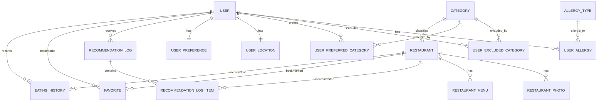

# 온유어런치 ERD

## 1. ERD 다이어그램



---

## 2. 테이블 정의

### 2.1. USER (사용자)

| 컬럼 | 타입 | 제약조건 | 설명 |
|------|------|----------|------|
| id | UUID | PK, DEFAULT gen_random_uuid() | 사용자 고유 ID |
| email | VARCHAR(255) | UNIQUE, NOT NULL | Google OAuth 이메일 |
| nickname | VARCHAR(10) | NOT NULL | 닉네임 (2~10자, 한글/영문/숫자) |
| profile_image_url | TEXT | NULL 허용 | 프로필 사진 URL (NULL이면 기본 아바타) |
| google_id | VARCHAR(255) | UNIQUE, NOT NULL | Google OAuth 고유 ID |
| refresh_token | TEXT | NULL 허용 | Refresh Token (로그아웃 시 NULL) |
| notification_enabled | BOOLEAN | NOT NULL, DEFAULT true | 푸시 알림 ON/OFF |
| notification_time | TIME | NOT NULL, DEFAULT '11:30' | 알림 시간 |
| marketing_agreed | BOOLEAN | NOT NULL, DEFAULT false | 마케팅 수신 동의 |
| terms_agreed_at | TIMESTAMPTZ | NOT NULL | 필수 약관 동의 시각 |
| expo_push_token | TEXT | NULL 허용 | Expo 푸시 토큰 (모바일 앱에서 등록) |
| preferred_price_range | VARCHAR(20) | NOT NULL | 선호 가격대: 'UNDER_10K', 'BETWEEN_10K_20K', 'OVER_20K' |
| is_onboarding_completed | BOOLEAN | NOT NULL, DEFAULT false | 온보딩 완료 여부 |
| deleted_at | TIMESTAMPTZ | NULL 허용 | 소프트 삭제 시각 (NULL이면 활성) |
| created_at | TIMESTAMPTZ | NOT NULL, DEFAULT NOW() | 가입 시각 |
| updated_at | TIMESTAMPTZ | NOT NULL, DEFAULT NOW() | 마지막 수정 시각 |

**인덱스:**
- `idx_user_email` — UNIQUE (email)
- `idx_user_google_id` — UNIQUE (google_id)
- `idx_user_deleted_at` — (deleted_at) WHERE deleted_at IS NULL (활성 사용자 조회 최적화)

---

### 2.2. USER_LOCATION (사용자 회사 위치)

| 컬럼 | 타입 | 제약조건 | 설명 |
|------|------|----------|------|
| id | UUID | PK | |
| user_id | UUID | FK → USER.id, UNIQUE, NOT NULL | 사용자 1:1 (회사 위치 1개만) |
| latitude | DECIMAL(9,6) | NOT NULL | 위도 (소수점 6자리) |
| longitude | DECIMAL(9,6) | NOT NULL | 경도 (소수점 6자리) |
| address | VARCHAR(255) | NOT NULL | 도로명 주소 |
| building_name | VARCHAR(100) | NULL 허용 | 건물명 |
| created_at | TIMESTAMPTZ | NOT NULL, DEFAULT NOW() | |
| updated_at | TIMESTAMPTZ | NOT NULL, DEFAULT NOW() | |

**인덱스:**
- `idx_user_location_user_id` — UNIQUE (user_id)

**USER와 분리한 이유:** 위치 데이터(위도, 경도)는 추천 알고리즘에서 매번 식당 좌표와 거리 계산에 사용된다. USER 테이블을 조회할 때마다 위치 컬럼이 딸려오면 불필요한 IO가 발생. 위치 변경 이력 추적이 필요해지면 이 테이블에 이력 컬럼을 추가하기도 용이.

---

### 2.3. USER_PREFERENCE (사용자 취향) — 관계 테이블 3개

#### USER_PREFERRED_CATEGORY (선호 카테고리, N:M)

| 컬럼 | 타입 | 제약조건 | 설명 |
|------|------|----------|------|
| id | UUID | PK | |
| user_id | UUID | FK → USER.id, NOT NULL | |
| category_id | UUID | FK → CATEGORY.id, NOT NULL | |
| created_at | TIMESTAMPTZ | NOT NULL, DEFAULT NOW() | |

**인덱스:**
- `idx_upc_user_category` — UNIQUE (user_id, category_id)

#### USER_EXCLUDED_CATEGORY (제외 카테고리, N:M)

| 컬럼 | 타입 | 제약조건 | 설명 |
|------|------|----------|------|
| id | UUID | PK | |
| user_id | UUID | FK → USER.id, NOT NULL | |
| category_id | UUID | FK → CATEGORY.id, NOT NULL | |
| created_at | TIMESTAMPTZ | NOT NULL, DEFAULT NOW() | |

**인덱스:**
- `idx_uec_user_category` — UNIQUE (user_id, category_id)

#### USER_ALLERGY (알레르기, N:M)

| 컬럼 | 타입 | 제약조건 | 설명 |
|------|------|----------|------|
| id | UUID | PK | |
| user_id | UUID | FK → USER.id, NOT NULL | |
| allergy_type_id | UUID | FK → ALLERGY_TYPE.id, NOT NULL | |
| created_at | TIMESTAMPTZ | NOT NULL, DEFAULT NOW() | |

**인덱스:**
- `idx_ua_user_allergy` — UNIQUE (user_id, allergy_type_id)

---

### 2.4. CATEGORY (카테고리 마스터)

| 컬럼 | 타입 | 제약조건 | 설명 |
|------|------|----------|------|
| id | UUID | PK | |
| name | VARCHAR(30) | UNIQUE, NOT NULL | 자체 카테고리명: '한식', '중식', '일식', '양식', '아시안', '분식/간편식', '샐러드/건강식' |
| color_code | VARCHAR(7) | NOT NULL | 카테고리 색상 (캘린더 dot, 지도 핀 색상용) |
| sort_order | INT | NOT NULL | 표시 순서 |
| created_at | TIMESTAMPTZ | NOT NULL, DEFAULT NOW() | |

**초기 데이터 (7건):**

| name | color_code | sort_order |
|------|-----------|------------|
| 한식 | #FF8C00 | 1 |
| 중식 | #FF0000 | 2 |
| 일식 | #0066FF | 3 |
| 양식 | #00AA00 | 4 |
| 아시안 | #9900CC | 5 |
| 분식/간편식 | #FFCC00 | 6 |
| 샐러드/건강식 | #66CC00 | 7 |

---

### 2.5. ALLERGY_TYPE (알레르기 마스터)

| 컬럼 | 타입 | 제약조건 | 설명 |
|------|------|----------|------|
| id | UUID | PK | |
| name | VARCHAR(20) | UNIQUE, NOT NULL | '갑각류', '견과류', '유제품', '밀', '달걀', '대두' |
| sort_order | INT | NOT NULL | 표시 순서 |

**초기 데이터 (6건):** 갑각류, 견과류, 유제품, 밀, 달걀, 대두

---

### 2.6. RESTAURANT (식당)

| 컬럼 | 타입 | 제약조건 | 설명 |
|------|------|----------|------|
| id | UUID | PK | |
| kakao_place_id | VARCHAR(50) | UNIQUE, NULL 허용 | 카카오 로컬 API place ID (직접 입력 식당은 NULL) |
| name | VARCHAR(100) | NOT NULL | 식당명 |
| category_id | UUID | FK → CATEGORY.id, NOT NULL | 자체 카테고리 |
| address | VARCHAR(255) | NOT NULL | 도로명 주소 |
| latitude | DECIMAL(9,6) | NOT NULL | 위도 |
| longitude | DECIMAL(9,6) | NOT NULL | 경도 |
| phone | VARCHAR(20) | NULL 허용 | 전화번호 |
| description | VARCHAR(200) | NULL 허용 | 한줄 설명 ("점심 백반이 유명한 집") |
| price_range | VARCHAR(20) | NULL 허용 | 'UNDER_10K', 'BETWEEN_10K_20K', 'OVER_20K' (NULL이면 가격 정보 없음) |
| business_hours | VARCHAR(200) | NULL 허용 | 영업시간 텍스트 |
| thumbnail_url | TEXT | NULL 허용 | 대표 사진 URL |
| is_user_created | BOOLEAN | NOT NULL, DEFAULT false | 사용자가 직접 입력한 식당 여부 |
| is_closed | BOOLEAN | NOT NULL, DEFAULT false | 폐업 여부 |
| data_source | VARCHAR(20) | NOT NULL, DEFAULT 'KAKAO' | 데이터 출처: 'KAKAO', 'MANUAL', 'USER' |
| created_at | TIMESTAMPTZ | NOT NULL, DEFAULT NOW() | |
| updated_at | TIMESTAMPTZ | NOT NULL, DEFAULT NOW() | |

**인덱스:**
- `idx_restaurant_kakao_place_id` — UNIQUE (kakao_place_id) WHERE kakao_place_id IS NOT NULL
- `idx_restaurant_category` — (category_id)
- `idx_restaurant_location` — PostGIS GIST 인덱스 on geography(latitude, longitude) — 반경 검색 최적화
- `idx_restaurant_name_search` — GIN (to_tsvector('simple', name)) — 식당명 검색용

**PostGIS 컬럼 추가 (마이그레이션 시):**
```sql
ALTER TABLE restaurant ADD COLUMN geom GEOGRAPHY(POINT, 4326);
UPDATE restaurant SET geom = ST_SetSRID(ST_MakePoint(longitude, latitude), 4326);
CREATE INDEX idx_restaurant_geom ON restaurant USING GIST(geom);
```

이 `geom` 컬럼으로 `ST_DWithin(geom, user_location, distance_meters)` 쿼리를 사용하여 반경 내 식당을 인덱스로 빠르게 조회.

---

### 2.7. RESTAURANT_MENU (식당 메뉴)

| 컬럼 | 타입 | 제약조건 | 설명 |
|------|------|----------|------|
| id | UUID | PK | |
| restaurant_id | UUID | FK → RESTAURANT.id, NOT NULL | |
| name | VARCHAR(100) | NOT NULL | 메뉴명 |
| price | INT | NULL 허용 | 가격 (원). NULL이면 가격 미확인 |
| sort_order | INT | NOT NULL, DEFAULT 0 | 표시 순서 |
| created_at | TIMESTAMPTZ | NOT NULL, DEFAULT NOW() | |

**인덱스:**
- `idx_restaurant_menu_restaurant` — (restaurant_id)

---

### 2.8. RESTAURANT_PHOTO (식당 사진)

| 컬럼 | 타입 | 제약조건 | 설명 |
|------|------|----------|------|
| id | UUID | PK | |
| restaurant_id | UUID | FK → RESTAURANT.id, NOT NULL | |
| image_url | TEXT | NOT NULL | 사진 URL (Cloudflare R2) |
| is_thumbnail | BOOLEAN | NOT NULL, DEFAULT false | 대표 사진 여부 |
| sort_order | INT | NOT NULL, DEFAULT 0 | |
| created_at | TIMESTAMPTZ | NOT NULL, DEFAULT NOW() | |

**인덱스:**
- `idx_restaurant_photo_restaurant` — (restaurant_id)

---

### 2.9. EATING_HISTORY (먹은 이력)

| 컬럼 | 타입 | 제약조건 | 설명 |
|------|------|----------|------|
| id | UUID | PK | |
| user_id | UUID | FK → USER.id, NOT NULL | 기록 주체 |
| restaurant_id | UUID | FK → RESTAURANT.id, NULL 허용 | 기록 대상 식당 (직접 입력 시 NULL) |
| manual_restaurant_name | VARCHAR(100) | NULL 허용 | 직접 입력 식당명 (restaurant_id가 NULL일 때) |
| manual_category_id | UUID | FK → CATEGORY.id, NULL 허용 | 직접 입력 카테고리 (restaurant_id가 NULL일 때) |
| eaten_date | DATE | NOT NULL | 먹은 날짜 |
| rating | SMALLINT | NOT NULL, CHECK (rating BETWEEN 1 AND 5) | 별점 (1~5 정수) |
| memo | VARCHAR(300) | NULL 허용 | 한줄 메모 (최대 300자) |
| is_from_recommendation | BOOLEAN | NOT NULL, DEFAULT false | 추천에서 기록했는지 여부 |
| created_at | TIMESTAMPTZ | NOT NULL, DEFAULT NOW() | |
| updated_at | TIMESTAMPTZ | NOT NULL, DEFAULT NOW() | |

**인덱스:**
- `idx_eating_history_user_date` — UNIQUE (user_id, restaurant_id, eaten_date) — 같은 날 같은 식당 중복 방지
- `idx_eating_history_user_recent` — (user_id, eaten_date DESC) — 추천 알고리즘용 (최근 5일 조회)
- `idx_eating_history_user_month` — (user_id, eaten_date) — 캘린더 월별 조회용

---

### 2.10. FAVORITE (즐겨찾기)

| 컬럼 | 타입 | 제약조건 | 설명 |
|------|------|----------|------|
| id | UUID | PK | |
| user_id | UUID | FK → USER.id, NOT NULL | |
| restaurant_id | UUID | FK → RESTAURANT.id, NOT NULL | |
| created_at | TIMESTAMPTZ | NOT NULL, DEFAULT NOW() | 즐겨찾기 추가 시각 |

**인덱스:**
- `idx_favorite_user_restaurant` — UNIQUE (user_id, restaurant_id)
- `idx_favorite_user_created` — (user_id, created_at DESC) — 즐겨찾기 목록 최신순 조회

---

### 2.11. RECOMMENDATION_LOG (추천 기록)

추천 알고리즘 이력 관리 + 새로고침 횟수 카운트 + 중복 추천 방지용.

| 컬럼 | 타입 | 제약조건 | 설명 |
|------|------|----------|------|
| id | UUID | PK | |
| user_id | UUID | FK → USER.id, NOT NULL | |
| recommendation_date | DATE | NOT NULL | 추천 날짜 |
| refresh_count | SMALLINT | NOT NULL, DEFAULT 0 | 새로고침 횟수 (0=최초, 최대 5) |
| filter_category_ids | UUID[] | NULL 허용 | 적용된 카테고리 필터 (배열) |
| filter_price_range | VARCHAR(20) | NULL 허용 | 적용된 가격대 필터 |
| filter_walk_minutes | SMALLINT | NULL 허용 | 적용된 도보 거리 필터 (분) |
| created_at | TIMESTAMPTZ | NOT NULL, DEFAULT NOW() | |

**인덱스:**
- `idx_recommendation_log_user_date` — (user_id, recommendation_date DESC)

---

### 2.12. RECOMMENDATION_LOG_ITEM (추천 상세 — 추천된 식당 3개)

| 컬럼 | 타입 | 제약조건 | 설명 |
|------|------|----------|------|
| id | UUID | PK | |
| recommendation_log_id | UUID | FK → RECOMMENDATION_LOG.id, NOT NULL | |
| restaurant_id | UUID | FK → RESTAURANT.id, NOT NULL | 추천된 식당 |
| display_order | SMALLINT | NOT NULL | 카드 순서 (1, 2, 3) |

**인덱스:**
- `idx_rli_log_id` — (recommendation_log_id)
- `idx_rli_restaurant` — (restaurant_id) — 식당별 추천 횟수 분석용

---

### 2.13. KAKAO_CATEGORY_MAPPING (카카오 카테고리 매핑)

카카오 로컬 API의 카테고리를 자체 7개 카테고리로 변환하는 룰 테이블.

| 컬럼 | 타입 | 제약조건 | 설명 |
|------|------|----------|------|
| id | UUID | PK | |
| kakao_category | VARCHAR(100) | UNIQUE, NOT NULL | 카카오 카테고리 문자열 (예: "음식점 > 한식 > 백반") |
| category_id | UUID | FK → CATEGORY.id, NULL 허용 | 매핑된 자체 카테고리 (NULL이면 UNMAPPED) |
| created_at | TIMESTAMPTZ | NOT NULL, DEFAULT NOW() | |

---

### 2.14. EVENT_LOG (추적 이벤트)

데이터 분석용 이벤트 로그. 기능 명세서에서 정의된 모든 추적 이벤트를 저장.

| 컬럼 | 타입 | 제약조건 | 설명 |
|------|------|----------|------|
| id | UUID | PK | |
| user_id | UUID | FK → USER.id, NULL 허용 | 비로그인 이벤트 시 NULL |
| event_name | VARCHAR(50) | NOT NULL | 이벤트명 (recommendation_viewed, ate_here_clicked 등) |
| event_data | JSONB | NOT NULL, DEFAULT '{}' | 이벤트별 상세 데이터 (JSON) |
| created_at | TIMESTAMPTZ | NOT NULL, DEFAULT NOW() | 이벤트 발생 시각 |

**인덱스:**
- `idx_event_log_user_created` — (user_id, created_at DESC)
- `idx_event_log_name_created` — (event_name, created_at DESC)

**JSONB를 사용한 이유:** 이벤트 종류가 20개 이상이고, 각 이벤트마다 수집 항목이 다르다. 이벤트별로 테이블을 만들면 테이블 수가 폭증한다. JSONB로 유연하게 저장하고, 분석 시 JSON 쿼리로 추출. PostgreSQL의 JSONB GIN 인덱스를 필요 시 추가.

---

## 3. 테이블 관계 요약

| 관계 | 타입 | 설명 |
|------|------|------|
| USER ↔ USER_LOCATION | 1:1 | 사용자 1명당 회사 위치 1개 |
| USER ↔ USER_PREFERRED_CATEGORY | 1:N | 복수 선호 카테고리 |
| USER ↔ USER_EXCLUDED_CATEGORY | 1:N | 복수 제외 카테고리 |
| USER ↔ USER_ALLERGY | 1:N | 복수 알레르기 |
| USER ↔ EATING_HISTORY | 1:N | 먹은 이력 다건 |
| USER ↔ FAVORITE | 1:N | 즐겨찾기 다건 |
| USER ↔ RECOMMENDATION_LOG | 1:N | 날짜별 추천 기록 |
| RESTAURANT ↔ EATING_HISTORY | 1:N | 식당별 방문 기록 |
| RESTAURANT ↔ FAVORITE | 1:N | 식당별 즐겨찾기 |
| RESTAURANT ↔ RESTAURANT_MENU | 1:N | 식당별 메뉴 |
| RESTAURANT ↔ RESTAURANT_PHOTO | 1:N | 식당별 사진 |
| RESTAURANT ↔ CATEGORY | N:1 | 식당은 1개 카테고리 (자체 분류) |
| RECOMMENDATION_LOG ↔ RECOMMENDATION_LOG_ITEM | 1:N | 추천 1회에 식당 3건 |
| KAKAO_CATEGORY_MAPPING ↔ CATEGORY | N:1 | 카카오 카테고리 여러 개가 자체 1개에 매핑 |

---

## 4. 소프트 삭제 전략

| 테이블 | 소프트 삭제 | 이유 |
|--------|------------|------|
| USER | O (deleted_at) | 탈퇴 후 30일 보관 후 물리 삭제 (개인정보보호법) |
| EATING_HISTORY | X (즉시 삭제) | 사용자가 직접 삭제하는 기능, 복구 불필요 |
| FAVORITE | X (즉시 삭제) | 토글 방식이라 복구 불필요 |
| RESTAURANT | X (is_closed 플래그) | 폐업이지 삭제가 아님. 즐겨찾기한 사용자에게 "폐업" 표시 필요 |

사용자 탈퇴 시 연관 데이터 처리:
1. USER.deleted_at 설정 (소프트 삭제)
2. USER_LOCATION, USER_PREFERRED_CATEGORY, USER_EXCLUDED_CATEGORY, USER_ALLERGY → 즉시 삭제
3. EATING_HISTORY, FAVORITE → 즉시 삭제
4. RECOMMENDATION_LOG → 익명화 (user_id를 NULL로 변경, 분석 데이터 보존)
5. 30일 후 배치 작업으로 USER 레코드 물리 삭제

---

## 5. 마이그레이션 전략

| 단계 | 시점 | 내용 |
|------|------|------|
| V1 | 개발 시작 | 위 전체 스키마 초기 생성 |
| V2 | 콜드스타트 데이터 수집 | KAKAO_CATEGORY_MAPPING 초기 데이터 insert, CATEGORY/ALLERGY_TYPE 시드 데이터 |
| V3 | 출시 전 | PostGIS 확장 활성화, geom 컬럼 추가, 인덱스 생성 |

Prisma의 `prisma migrate dev` → `prisma migrate deploy` 흐름으로 관리. SQL 직접 작성이 필요한 PostGIS 관련은 Prisma의 `prisma migrate diff` + 수동 SQL 마이그레이션으로 처리.
